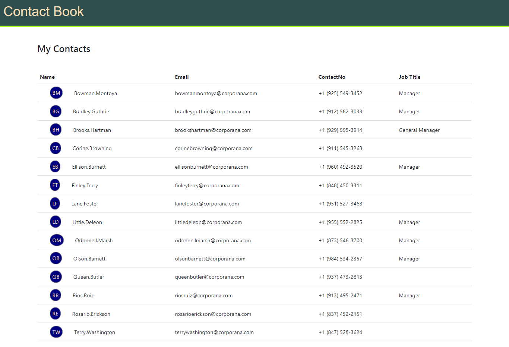

## Hackathon - Display Contact List

### Context

Prime solutions is an IT solutions provider company who have earned reputation in providing IT solutions in different business domains.

Recently they have received a project to develop contact book app.

Prime solutions have approached Graffitti designers for a good UI design.

The design is ready and now it needs to be made functional.

The development will be carried out in stages.

In the first two stages, inputs are captured, validated and posted to server.

The project has entered its third stage of development.

In this stage, you as a frontend developer have to fetch the data and display it on UI.

### Problem Statement

Fetch the details stored from `contacts.json` file through `json-server`

Display the key details, such as

- FirstName
- LastName
- Email
- Home Contact No

The contact list should be arranged in the alphabetical order by the firstname

The contact list should be displayed in tabular format as suggested below:

### Instructions

1. Fork and clone the boilerplate.
2. Open the boilerplate code in VSCode.
3. The boilerplate code contains two folders:
    - `contact-data`
        - This folder contains `contacts.json` file with contacts data.
        - Start `json-server` to launch api that serves this contacts data.
    - `contact-diary`
        - This folder defines the folder structure for writing the solution code.
4. Modify the `index.html` file by copying the Bootstrap’s production-ready CSS and JavaScript via CDN template to create a responsive page.
5. The custom CSS styles should be defined in `styles.css` file located under `css` folder.
6. The JavaScript solution should be written inside `index.js` file located under `js` folder.
7. Ensure the external CSS stylesheet file and the script file are linked with the `index.html` file.
8. Test the solution by running the page using `Live Server` - the VSCode extension.
9. Once the desired solution, is achieved, push the solution to the git for evaluation.